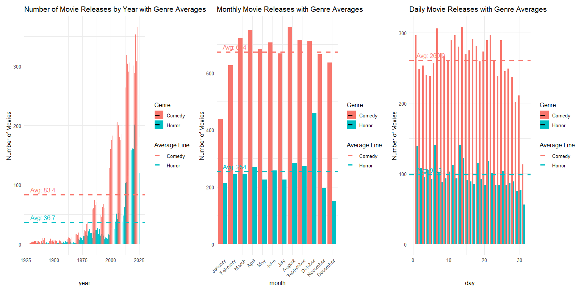
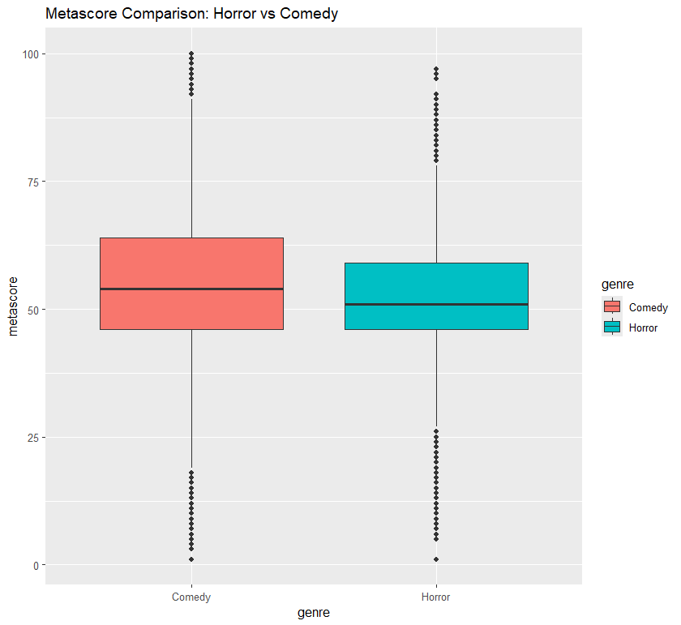
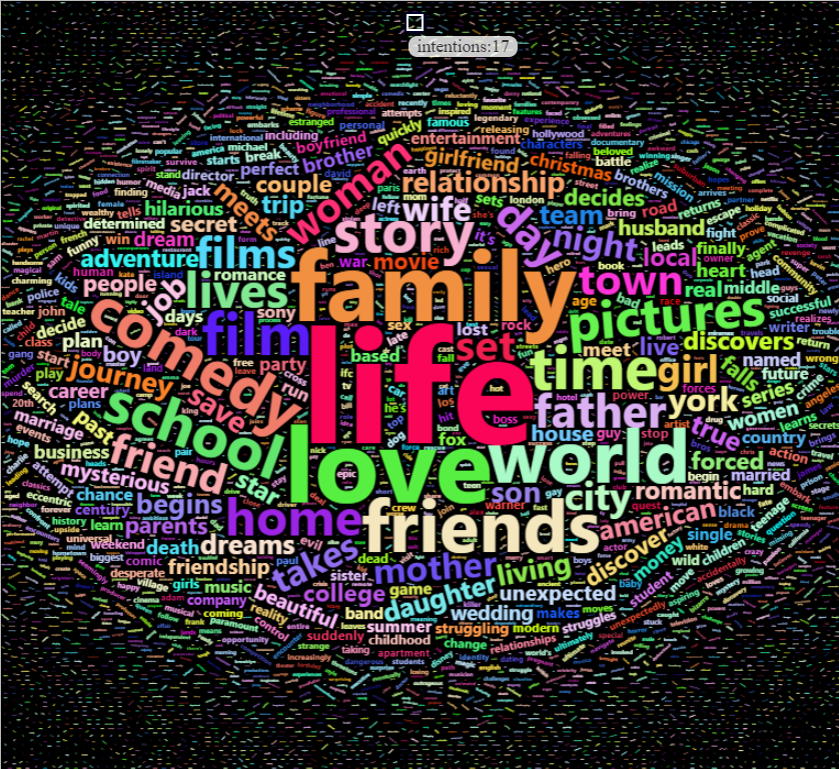
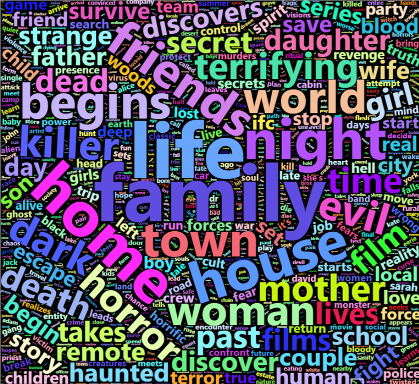
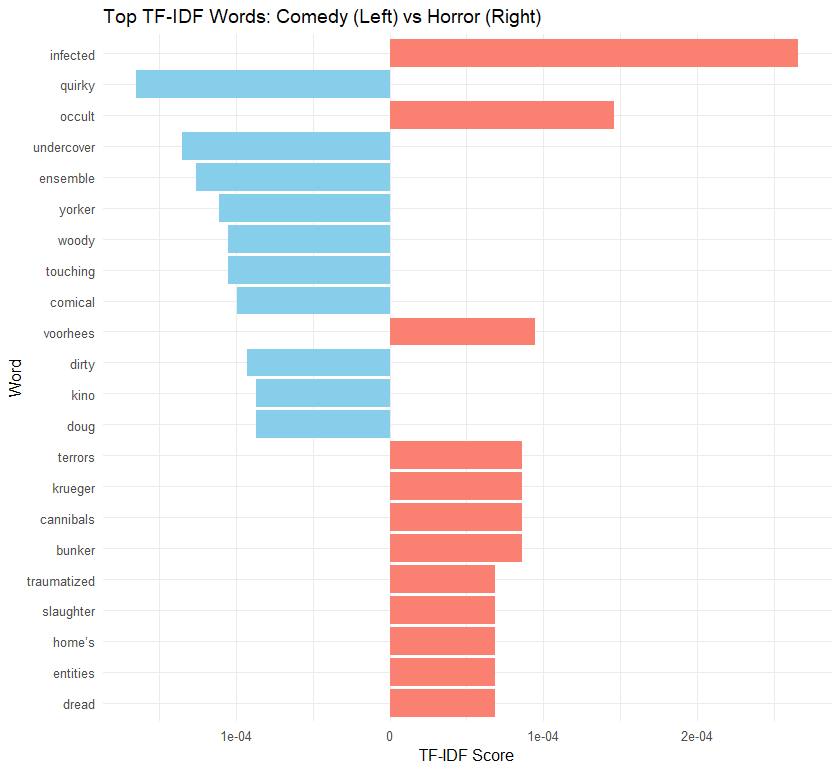
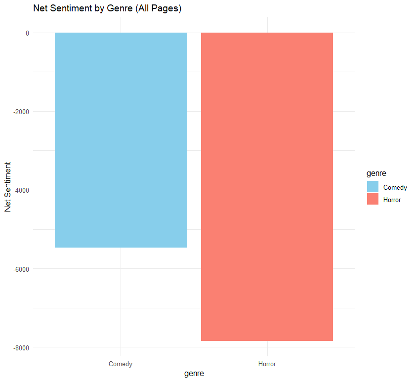
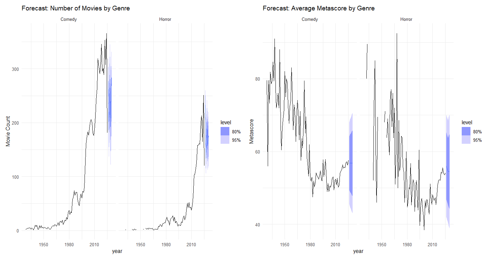

# 🎬 Metacritic Movie Genre Analysis: Comedy vs Horror

  

  
  
  

---

## 📌 Overview

This project explores and compares **Comedy** and **Horror** movie genres using web-scraped data from [Metacritic.com](https://www.metacritic.com). It integrates **web scraping**, **text mining**, **sentiment analysis**, and **time series forecasting** to uncover genre-specific patterns in movie content, release timing, reception, and emotional tone.

---

## 🧰 Methods Used

- **Web Scraping**: `rvest`, `httr`
- **Text Cleaning**: `tidytext`, `tm`, `stringr`
- **Sentiment Analysis**: `syuzhet`, `textdata` (NRC lexicon)
- **Visualization**: `ggplot2`, `wordcloud`, `facet_wrap`, `coord_flip`
- **Forecasting**: `forecast`, `fpp2`, `ARIMA`

---

## 📊 Key Insights

### 🎬 1. Genre Composition

- Total Movies Scraped:  
  - **Comedy**: 8088  
  - **Horror**: 3048

- Missing `Metascore`: Mostly newer releases lacking critic reviews.

---

### 📅 2. Release Patterns

- Comedy movies released more consistently throughout the year.
- Horror movies peak around **October**, suggesting a Halloween effect.

---

### 🧪 3. Metascore Comparison

- **Comedy** average: ~54  
- **Horror** average: ~51  
- **T-test** confirmed significant difference.

  

---

### 🔠 4. Word Frequency & TF-IDF

- **Comedy Top Words**: life, love, wedding, quirky, ensemble  
- **Horror Top Words**: escape, killer, dark, infected, occult

  
  

  

---

### ❤️ 5. NRC Sentiment Analysis

- Both genres skew **negative**, but Horror has more negative value 

  

---

### 🔮 6. Forecasting

- ARIMA models forecast a **slight drop** in number of movies
- Metascore projected to **increase** gradually for both genres

---

📂For more plots and visualizations, please see the [plots folder](./plots).

---

## 👨‍🎓 Author 

**Author:** Azrul Zulhilmi Ahmad Rosli

## License

This project is for academic purposes. Data source: [Metacritic -Movie Reviews](https://www.metacritic.com/).

---

